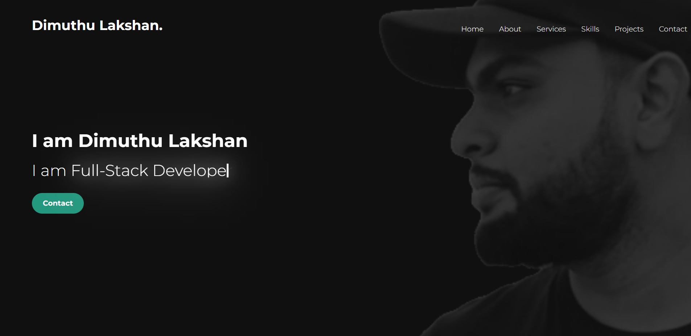
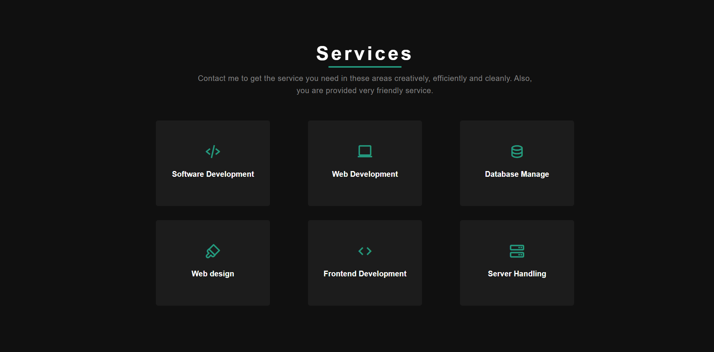
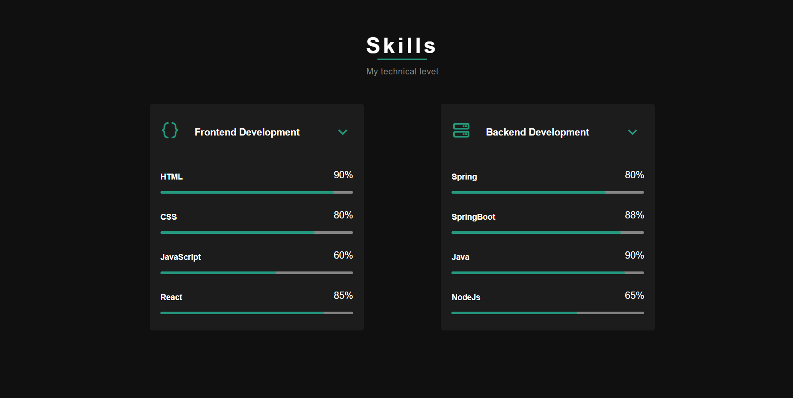
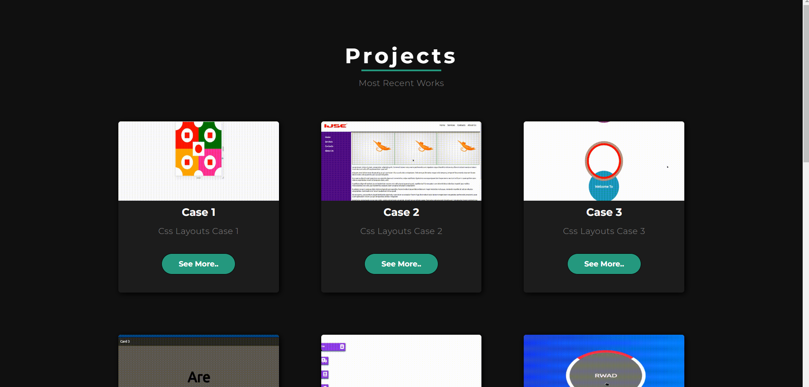
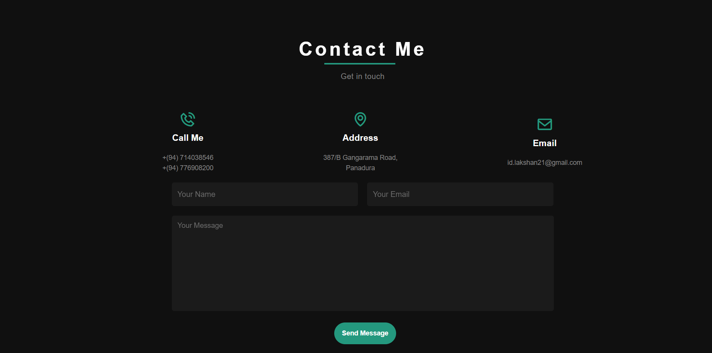
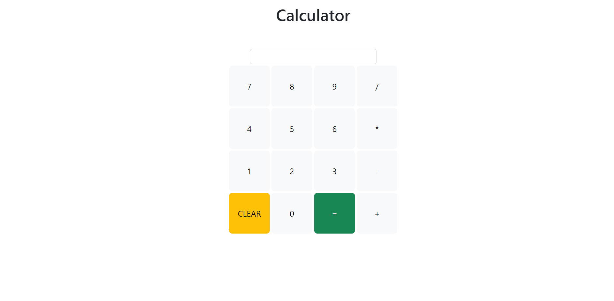
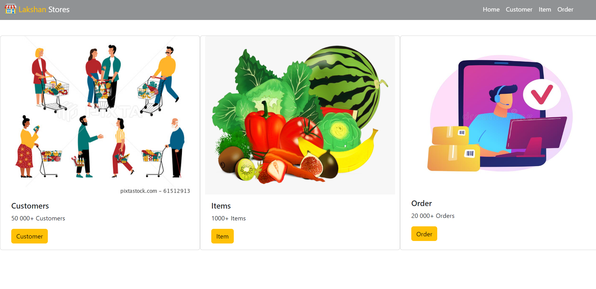
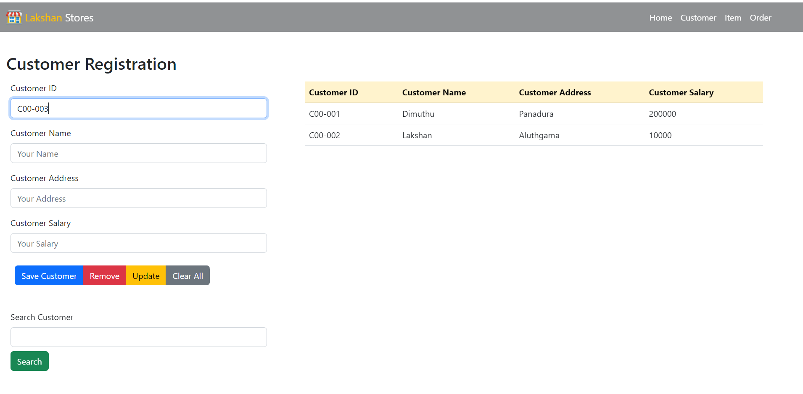
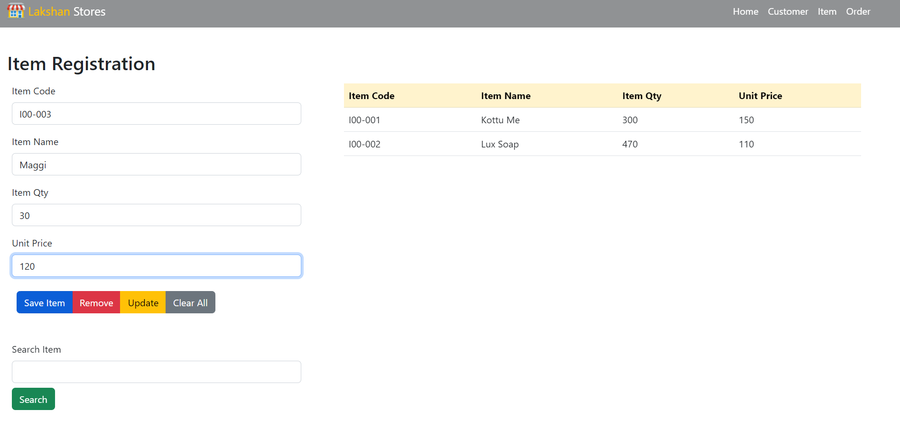
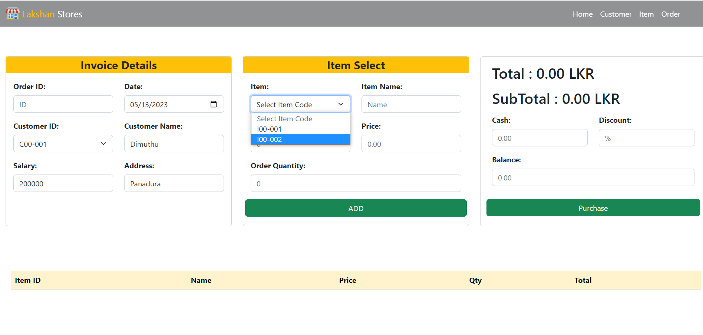

# My-Portfolio

---
## Content in this Repository.

* My Portfolio
* Calculator.
* Web-POS System (Bootstrap,JS).

---
### Description.

#### This website shows some information about my career.I categorize them into sections.
* Home Page.
* About Me.
* Services.
* Skills.
* Projects.
* Contact Me.

#### This website is Optimized to Provide for All Mobile & Desktop Devices you Can View

---

# Reference Links
📍 Site-Map:
https://www.gloomaps.com/aGEE4WpZaM

🖼 Mock Up: https://www.figma.com/file/aEmX30VxysrlUhtGyxIuv6/Untitled?type=design&node-id=1-15&t=LABWpgA2goEqnJvO-0

### Languages & Tools

* HTML
* CSS
* Java Script
* Intellij IDEA
---

# Portfolio View.
Landing Page

About Me

Service

Skills

Projects

Contact

---

# calculator

### Technology,Tools & Framework

* HTML.
* CSS.
* Java Script.
* Bootstrap.
* IntelliJ IDEA.
---

---

# Web-POS System (Bootstrap)

---
### Description.

#### SPA POS System. can Manage customers and items and place an order.
* Dashboard.
* Customer.
* Items.
* Place Order.
---
### Technology,Tools & Framework

* HTML.
* CSS.
* Java Script
* jQuery.
* Bootstrap.
* IntelliJ IDEA.
---
# SPA POS View

Dashboard

Customer Page

Item Page

Order Page

